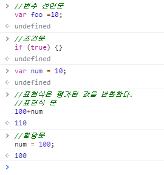

# 5장 표현식과 문

## 5.1 값

- 값 : **식(표현식)**이 **평가**되어 생성된 **결과**

```javascript
// 10 + 20은 평가되어 숫자 값 30을 생성한다.
10 + 20; // 30
```

- 변수 : **하나의 값**을 저장하기 위해 확보한 **메모리 공간 자체** 또는 그 메모리 공간을 식별하기 위해 붙인 이름.

## 5.2 리터럴

- 사람이 이해할 수 있는 문자 또는 약속된 기호를 사용해 값을 생성하는 표기법
- 자바스크립트 엔진은 코드가 실행되는 시점인 런타임에 리터럴을 평가해 값을 생성한다.

| 리터럴             | 예시                            |
| ------------------ | ------------------------------- |
| 정수 리터럴        | 100                             |
| 부동소수점 리터럴  | 10.5                            |
| 2진수 리터럴       | 0b01000001                      |
| 8진수 리터럴       | 0o101                           |
| 16진수 리터럴      | 0x41                            |
| 문자열 리터럴      | 'Hello', "World"                |
| 불리언 리터럴      | true, false                     |
| null 리터럴        | null                            |
| undefined 리터럴   | undefined                       |
| 객체 리터럴        | {name: 'Lee', address: 'Seoul'} |
| 배열 리터럴        | [1,2,3]                         |
| 함수 리터럴        | function(){}                    |
| 정규 표현식 리터럴 | /[A-Z]+/g                       |

## 5.3 표현식

- 표현식(expression)은 **값으로 평가**될 수 있는 문(statement)이다.
- 표현식은 리터럴, 식별자(변수, 함수 등의 이름), 연산자, 함수 호출 등의 조합으로 이뤄질 수 있다.

```javascript
// 예시 05-04
var score = 100;
//리터럴 100은 자바스크립트 엔진에 의해 평가되어 값을 생성하므로 그 자체로 표현식이다.

// 예시05-05
var score = 50 + 50;
//50 + 50은 리터럴과 연산자로 이뤄져있다. 
//50 + 50도 평가되어 숫자 값 100을 생성하므로 표현식이다.

// 예시05-06
score;
//score 변수 식별자를 참조했다.
//식별자 참조는 값을 생성하지는 않지만 값으로 평가되므로 표현식이다.


// 예시 05-07
// 1.리터럴 표현식
10
'Hello'

// 2.식별자 표현식(선언이 이미 존재한다고 가정)
sum
person.name
arr[1]

// 3.연산자 표현식
10 + 20
sum = 10
sum !== 10

// 4.함수/메서드 호출 표현식(선언이 이미 존재한다고 가정)
square()
person.getName()
```


- 표현식과 표현식이 평가된 값은 동치(equivalent)다.
- 표현식은 값처럼 사용할 수 있다. 값이 위치할 수 있는 자리에는 표현식도 위치할 수 있다.


## 5.4 문

- 문(statememt) : 프로그램을 구성하는 기본 단위이자 최소 실행 단위. (명령문이라고도 한다.)
- 토큰 : 문법적으로 더 이상 나눌 수 없는 코드의 기본 요소.
  - ex) 키워드, 식별자, 연산자, 리터럴, 세미콜론, 마침표 등

```javascript
var sum = 1 + 2;
//위의 한 문장 전체는 '문'
//각각 var / sum /  =  / 1  / + / 2 / ; / 는 토큰이다.
```

- 문의 종류 : 선언문, 할당문, 조건문, 반복문

```javascript
// 변수 선언문
var x;

// 표현식 문(할당문)
x = 5;

// 함수 선언문
function foo () {}

// 조건문
if (x > 1) { console.log(x); }

// 반복문
for (var i = 0; i < 2; i++) { console.log(i); }
```

## 5.5 세미콜론과 세미콜론 자동 삽입 기능

- 세미콜론(;)은 문의 종료를 나타낸다. 
- 코드 블록(if문, for문, 함수 등의 코드 블록)은 문의 종료를 의미하는 자체 종결성을 갖기 때문에 세미콜론을 붙이지 않는다.


- 세미콜론 자동 삽입 기능(ASI-Automatin semicolon insertion)이 암묵적으로 수행되지만, 개발자의 예측과 일치하지 않는 경우가 간혹 있기 때문에  세미콜론을 붙이는 것을 권장한다.

- ESLint에서는 세미콜론 사용을 기본으로 설정함
- TC39(ECMAScript 기술위원회)는 세미콜론 사용을 권장하는 분위기 

## 5.6 표현식인 문과 표현식이 아닌문

- 문에는 표현식인 문과 표현식이 아닌 문이 있다.

| 표현식인 문              | 표현식이 아닌 문         |
| ------------------------ | ------------------------ |
| 값으로 평가될 수 있는 문 | 값으로 평가될 수 없는 문 |
| 변수에 할당 가능         | 변수 할당시 에러가 발생  |
|                          |                          |

```javascript
// 변수 선언문은 표현식이 아닌 문이다.
var x;

// 할당문은 그 자체가 표현식이지만 완전한 문이기도 하다. 즉, 할당문은 표현식인 문이다.
x = 100;

// 표현식이 아닌 문은 값처럼 사용할 수 없다.
var foo = var x; // SyntaxError: Unexpected token var

// 표현식인 문은 값처럼 사용할 수 있다
var foo = x = 100;
console.log(foo); // 100
```


#### 완료값

- 크롬 개발자 도구에서 표현식이 아닌 문을 실행하면 언제나 undefined를 출력한다. 이를 완료 값이라고 한다.
- 완료값은 표현식의 평가 결과가 아니다. 따라서 다른 값과 같이 변수에 할당할 수 없고 참조할 수도 없다. 
- 크롬 개발자 도구에서 표현식인 문을 실행하면 언제나 평가된 값을 반환한다. 

