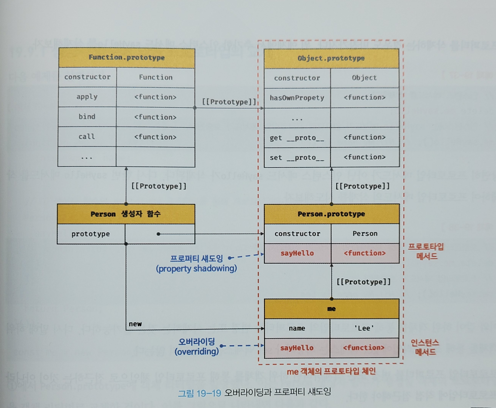

# 19.8 오버라이딩과 프로퍼티 섀도잉

#### 1. 소스코드 예시

```javascript
const Person = (function () {
  // 생성자 함수
  function Person(name) {
    this.name = name;
  }

  // 프로토타입 메서드
  Person.prototype.sayHello = function () {
    console.log(`Hi! My name is ${this.name}`);
  };

  // 생성자 함수를 반환
  return Person;
}());

const me = new Person('Lee');

// 인스턴스 메서드
me.sayHello = function () {
  console.log(`Hey! My name is ${this.name}`);
};

// 인스턴스 메서드가 호출된다. 프로토타입 메서드는 인스턴스 메서드에 의해 가려진다.
me.sayHello(); // Hey! My name is Lee
```

생성자 함수로 객체(인스턴스)-me를 생성하고, 인스턴스에 메서드-sayHello()를 추가했다.



#### 2.프로퍼티 섀도잉

- **프로퍼티 섀도잉**: 상속 관계에 의해 프로퍼티가 가려지는 현상


- **프로토타입 프로퍼티** : 프로토타입이 소유한 프로퍼티(메서드 포함)

- **인스턴스 프로퍼티** : 인스턴스가 소유한 프로퍼티

  

프로토타입 프로퍼티와 같은 이름의 프로퍼티를 인스턴스에 추가하면, 인스턴스 프로퍼티로 추가한다.

(프로토타입 체인을 따라 프로토타입 프로퍼티를 검색하여 프로토타입 프로퍼티를 덮어쓰는 것이 아님)


소스코드의 예시를 보면, 인스턴스 메서드 sayHello는 프로토타입 메서드 sayHello를 **오버라이딩**했고, 프로토타입 메서드 sayHello는 가려진다. (프로퍼티 섀도잉)


참고)

- **오버라이딩** : 상위 클래스가 가지고 있는 메서드를 하위 클래스가 **재정의**하여 사용하는 방식이다.
- **오버로딩** : 함수의 이름은 동일하지만 매개변수의 타입 또는 개수가 다른 메서드를 구현하고 매개변수에 의해 메서드를 구별하여 호출하는 방식이다. 자바스크립트는 오버로딩을 지원하지 않지만 arguments 객체를 사용하여 구현할 수는 있다.


#### 3. 프로퍼티를 삭제하는 경우

```javascript
// 인스턴스 메서드를 삭제한다.
delete me.sayHello;
// 인스턴스에는 sayHello 메서드가 없으므로 프로토타입 메서드가 호출된다.
me.sayHello(); // Hi! My name is Lee
```

첫째줄의 경우 인스턴스 메서드 sayHello가 삭제된다. 이후 sayHello를 호출하면 프로토타입 메서드가 호출된다.

만약 한 번 더 sayHello 메서드를 삭제한다면, 프로토타입 메서드가 삭제될까?

```javascript
// 프로토타입 체인을 통해 프로토타입 메서드가 삭제되지 않는다.
delete me.sayHello;
// 프로토타입 메서드가 호출된다.
me.sayHello(); // Hi! My name is Lee
```

하위 객체를 통해 프로토타입의 프로퍼티를 변경 또는 삭제하는 것은 불가능하다. 즉, 하위 객체를 통해 프로토타입에 get 액세스는 허용되나 set 액세스는 허용되지 않는다.

프로토타입 프로퍼티를 변경 또는 삭제하려면 하위 객체를 통해 프로토타입 체인으로 접근하는 것이 아니라 프로토타입에 직접 접근해야한다.

```javascript
// 프로토타입 메서드 변경
Person.prototype.sayHello = function () {
  console.log(`Hey! My name is ${this.name}`);
};
me.sayHello(); // Hey! My name is Lee

// 프로토타입 메서드 삭제
delete Person.prototype.sayHello;
me.sayHello(); // TypeError: me.sayHello is not a function

```

# 19.9 프로토타입의 교체

프로토타입은 임의의 다른 객체로 변경할 수 있다.

즉, 부모 객체인 프로토타입을 동적으로 변경할 수 있다.

이를 활용하여 객체간 상속관계를 동적으로 변경할 수 있다.

프로토타입은 생성자 함수 또는 인스턴스에 의해 교체할 수 있다.

## 19.9.1 생성자 함수에 의한 프로토타입 교체

```javascript
const Person = (function () {
  function Person(name) {
    this.name = name;
  }

  // ① 생성자 함수의 prototype 프로퍼티를 통해 프로토타입을 교체
  Person.prototype = {
    sayHello() {
      console.log(`Hi! My name is ${this.name}`);
    }
  };

  return Person;
}());

const me = new Person('Lee');
```

①에서 Person.prototype에 객체 리터럴을 할당했다. 이는 Person 생성자 함수가 생성할 객체의 프로토타입을 객체 리터럴로 교체한 것이다.

 

프로토타입이 교체한 객체 리터럴에는 constructor 프로퍼티가 없다. constructor 프로퍼티는 자바스크립트 엔진이 프로토타입을 생성할 때 암묵적으로 추가한 프로퍼티다. 따라서 me 객체의 생성자 함수를 검색하면 Person이 아닌 Object가 나온다.

```javascript
// 프로토타입을 교체하면 constructor 프로퍼티와 생성자 함수 간의 연결이 파괴된다.
console.log(me.constructor === Person); // false
// 프로토타입 체인을 따라 Object.prototype의 constructor 프로퍼티가 검색된다.
console.log(me.constructor === Object); // true
```

이처럼 프로토타입을 교체하면 constructor 프로퍼티와 생성자 함수 간의 연결이 파괴된다. 파괴된 constructor 프로퍼티와 생성자 함수 간의 연결을 되살려 보자. 프로토타입으로 교체한 객체 리터럴에 constructor 프로퍼티를 추가하여 프로토타입의 contructor 프로퍼티를 되살린다. 

``` javascript
const Person = (function () {
  function Person(name) {
    this.name = name;
  }

  // 생성자 함수의 prototype 프로퍼티를 통해 프로토타입을 교체
  Person.prototype = {
    // constructor 프로퍼티와 생성자 함수 간의 연결을 설정
    constructor: Person,
    sayHello() {
      console.log(`Hi! My name is ${this.name}`);
    }
  };

  return Person;
}());

const me = new Person('Lee');

// constructor 프로퍼티가 생성자 함수를 가리킨다.
console.log(me.constructor === Person); // true
console.log(me.constructor === Object); // false
```

## 19.9.2 인스턴스에 의한 프로토타입 교체

프로토타입은 생성자 함수의 prototype 프로퍼티뿐 아니라 인스턴스의 _ _ proto _ _ 접근자 프로퍼티(또는 Object.getPrototypeOf 메서드)를 통해 접근/교체할 수 있다.

생성자 함수의 prototype 프로퍼티에 다른 임의의 객체를 바인딩하는 것은 미래에 생성할 인스턴스의 프로토타입을 교체하는 것이다. _ _ proto _ _ 접근자 프로퍼티를 통해 프로토타입을 교체하는 것은 이미 생성된 객체의 프로토타입을 교체하는 것이다. 

```javascript
function Person(name) {
  this.name = name;
}

const me = new Person('Lee');

// 프로토타입으로 교체할 객체
const parent = {
  sayHello() {
    console.log(`Hi! My name is ${this.name}`);
  }
};

// ① me 객체의 프로토타입을 parent 객체로 교체한다.
Object.setPrototypeOf(me, parent);
// 위 코드는 아래의 코드와 동일하게 동작한다.
// me.__proto__ = parent;

me.sayHello(); // Hi! My name is Lee
```


프로토타입으로 교체한 객체에는 contructor 프로퍼티가 없으므로 constructor 프로퍼티와 생성자 함수 간의 연결이 파괴된다. 따라서 프로토타입의 contructor 프로퍼티로 me 객체의 생성자 함수를 검색하면 Person이 아닌 Object가 나온다.

```javascript
// 프로토타입을 교체하면 constructor 프로퍼티와 생성자 함수 간의 연결이 파괴된다.
console.log(me.constructor === Person); // false
// 프로토타입 체인을 따라 Object.prototype의 constructor 프로퍼티가 검색된다.
console.log(me.constructor === Object); // true
```

#### 19.9.1 생성자 함수에 의한 프로토타입 교체 vs 19.9.2 인스턴스에 의한 프로토타입 교체


프로토타입으로 교체한 객체 리터럴에 contructor 프로퍼티를 추가하고 생성자 함수의 prototype 프로퍼티를 재설정하여 파괴된 생성자 함수와 프로토타입 간의 연결을 되살려보자.

```javascript
function Person(name) {
  this.name = name;
}

const me = new Person('Lee');

// 프로토타입으로 교체할 객체
const parent = {
  // constructor 프로퍼티와 생성자 함수 간의 연결을 설정
  constructor: Person,
  sayHello() {
    console.log(`Hi! My name is ${this.name}`);
  }
};

// 생성자 함수의 prototype 프로퍼티와 프로토타입 간의 연결을 설정
Person.prototype = parent;

// me 객체의 프로토타입을 parent 객체로 교체한다.
Object.setPrototypeOf(me, parent);
// 위 코드는 아래의 코드와 동일하게 동작한다.
// me.__proto__ = parent;

me.sayHello(); // Hi! My name is Lee

// constructor 프로퍼티가 생성자 함수를 가리킨다.
console.log(me.constructor === Person); // true
console.log(me.constructor === Object); // false

// 생성자 함수의 prototype 프로퍼티가 교체된 프로토타입을 가리킨다.
console.log(Person.prototype === Object.getPrototypeOf(me)); // true
```

이처럼 프로토타입 교체를 통해 객체 간의 상속 관계를 동적으로 변경하는 것은 꽤나 번거롭다. 따라서 프로토타입은 직접 교체하지 않는 것이 좋다. 상속 관계를 인위적으로 설정하려면 19.11절의 '직접 상속'이 더 편리하고 안전하다. 또는, ES6에서 도입된 클래스를 사용하면 간편하고 직관적인 상속관계를 구현할 수 있다.


# 19.10 instanceof 연산자

- 객체 `instanceof` 생성자 함수

- 좌변에 객체를 가리키는 식별자, 우변에 생성자 함수를 가리키는 식별자를 피연산자로 받는다.

  우변의 피연산자가 함수가 아닌 경우, TypeError가 발생한다.

  우변의 생성자 함수의 prototype에 바인딩된 객체가 좌변의 객체의 프로토타입 체인 상에 존재하면 true, 아니면 false.

```javascript
// 생성자 함수
function Person(name) {
  this.name = name;
}

const me = new Person('Lee');

// Person.prototype이 me 객체의 프로토타입 체인 상에 존재하므로 true로 평가된다.
console.log(me instanceof Person); // true

// Object.prototype이 me 객체의 프로토타입 체인 상에 존재하므로 true로 평가된다.
console.log(me instanceof Object); // true
```

- instanceof 연산자가 어떻게 동작하는지 이해하기 위해 프로토타입을 교체해보자.

```javascript
// 생성자 함수
function Person(name) {
  this.name = name;
}

const me = new Person('Lee');

// 프로토타입으로 교체할 객체
const parent = {};

// 프로토타입의 교체
Object.setPrototypeOf(me, parent);

// Person 생성자 함수와 parent 객체는 연결되어 있지 않다.
console.log(Person.prototype === parent); // false
console.log(parent.constructor === Person); // false

// Person.prototype이 me 객체의 프로토타입 체인 상에 존재하지 않기 때문에 false로 평가된다.
console.log(me instanceof Person); // false

// Object.prototype이 me 객체의 프로토타입 체인 상에 존재하므로 true로 평가된다.
console.log(me instanceof Object); // true
```

me 객체는 프로토타입이 교체되어 프로토타입과 생성자 함수간 연결이 파괴되었지만 Person 생성자 함수에 의해 생성된 인스턴스임에는 틀림이 없다. 그러나 me `instanceof` Person 은 false로 평가된다.

이는 Person.prototype이 me 객체의 프로토타입 체인 상에 존재하지 않기 때문이다. 따라서 프로토타입으로 교체한 parent 객체를 Person 생성자 함수의 prototype 프로퍼티에 바인딩하면 me `instanceof` Person은 true로 평가될 것이다.

```javascript
// 생성자 함수
function Person(name) {
  this.name = name;
}

const me = new Person('Lee');

// 프로토타입으로 교체할 객체
const parent = {};

// 프로토타입의 교체
Object.setPrototypeOf(me, parent);

// Person 생성자 함수와 parent 객체는 연결되어 있지 않다.
console.log(Person.prototype === parent); // false
console.log(parent.constructor === Person); // false

// parent 객체를 Person 생성자 함수의 prototype 프로퍼티에 바인딩한다.
Person.prototype = parent;

// Person.prototype이 me 객체의 프로토타입 체인 상에 존재하므로 true로 평가된다.
console.log(me instanceof Person); // true

// Object.prototype이 me 객체의 프로토타입 체인 상에 존재하므로 true로 평가된다.
console.log(me instanceof Object); // true
```

위의 예시처럼, instanceof 연산자는 생성자 함수의 prototype에 바인딩된 객체가 프로토타입 체인 상에 존재하는 지 확인한다.(프로토타입의 contructor 프로퍼티가 가리키는 생성자 함수를 찾는 것이 아니다.)

me `instanceof` Person의 경우, me 객체의 프로토타입 체인 상 Person.prototype에 바인딩된 객체가 존재하는지 확인한다.

me `instanceof` Person의 경우, me 객체의 프로토타입 체인 상 Object.prototype에 바인딩된 객체가 존재하는지 확인한다.

```javascript
function isInstanceof(instance, constructor) {
  // 프로토타입 취득
  const prototype = Object.getPrototypeOf(instance);

  // 재귀 탈출 조건
  // prototype이 null이면 프로토타입 체인의 종점에 다다른 것이다.
  if (prototype === null) return false;

  // 프로토타입이 생성자 함수의 prototype 프로퍼티에 바인딩된 객체라면 true를 반환한다.
  // 그렇지 않다면 재귀 호출로 프로토타입 체인 상의 상위 프로토타입으로 이동하여 확인한다.
  return prototype === constructor.prototype || isInstanceof(prototype, constructor);
}

console.log(isInstanceof(me, Person)); // true
console.log(isInstanceof(me, Object)); // true
console.log(isInstanceof(me, Array));  // false
```

따라서 생성자 함수에 의해 프로토타입이 교체되어 constructor 프로퍼티와 생성자 함수 간의 연결이 파괴되어도, 생성자 함수의 prototype 프로퍼티와 프로토타입 간의 연결은 파괴되지 않으므로 instanceof는 아무런 영향을 받지 않는다.

```javascript
const Person = (function () {
  function Person(name) {
    this.name = name;
  }

  // 생성자 함수의 prototype 프로퍼티를 통해 프로토타입을 교체
  Person.prototype = {
    sayHello() {
      console.log(`Hi! My name is ${this.name}`);
    }
  };

  return Person;
}());

const me = new Person('Lee');

// constructor 프로퍼티와 생성자 함수 간의 연결은 파괴되어도 instanceof는 아무런 영향을 받지 않는다.
console.log(me.constructor === Person); // false

// Person.prototype이 me 객체의 프로토타입 체인 상에 존재하므로 true로 평가된다.
console.log(me instanceof Person); // true
// Object.prototype이 me 객체의 프로토타입 체인 상에 존재하므로 true로 평가된다.
console.log(me instanceof Object); // true
```

# 19.11 직접 상속

## 19.11.1 Object.create에 의한 직접 상속

- Object.create 메서드 : 명시적으로 프로토타입을 지정하여 새로운 객체를 생성함. 다른 객체 방식과 마찬가지로 추상 연산 OrdinaryObjectCreate를 호출함.

- 첫 번째 매개변수 :  생성할 객체의 프로토타입으로 지정할 객체를 전달

  두 번째 매개변수 : 생성할 객체의 프로퍼티 키와, 프로퍼티 디스크립터 객체로 이뤄진 객체를 전달. (Object.defineProperties메서드의 두번째 인수와 동일). 옵션이므로 생략가능.

- 첫 번째 매개변수에 전달한 객체의 **프로토타입 체인에 속하는 객체를 생성**한다. 

  즉, 객체를 생성하면서 **직접적으로 상속을 구현**하는 것이다. 

```javascript
// 프로토타입이 null인 객체를 생성한다. 생성된 객체는 프로토타입 체인의 종점에 위치한다.
// obj → null
let obj = Object.create(null);
console.log(Object.getPrototypeOf(obj) === null); // true
// Object.prototype을 상속받지 못한다.
console.log(obj.toString()); // TypeError: obj.toString is not a function

// obj → Object.prototype → null
// obj = {};와 동일하다.
obj = Object.create(Object.prototype);
console.log(Object.getPrototypeOf(obj) === Object.prototype); // true

// obj → Object.prototype → null
// obj = { x: 1 };와 동일하다.
obj = Object.create(Object.prototype, {
  x: { value: 1, writable: true, enumerable: true, configurable: true }
});
// 위 코드는 다음과 동일하다.
// obj = Object.create(Object.prototype);
// obj.x = 1;
console.log(obj.x); // 1
console.log(Object.getPrototypeOf(obj) === Object.prototype); // true

const myProto = { x: 10 };
// 임의의 객체를 직접 상속받는다.
// obj → myProto → Object.prototype → null
obj = Object.create(myProto);
console.log(obj.x); // 10
console.log(Object.getPrototypeOf(obj) === myProto); // true

// 생성자 함수
function Person(name) {
  this.name = name;
}

// obj → Person.prototype → Object.prototype → null
// obj = new Person('Lee')와 동일하다.
obj = Object.create(Person.prototype);
obj.name = 'Lee';
console.log(obj.name); // Lee
console.log(Object.getPrototypeOf(obj) === Person.prototype); // true
```

#### Object.create 메서드의 장점

- new 연산자가 없이도 객체를 생성할 수 있다.
- 프로토타입을 지정하면서 객체를 생성할 수 있다.
- 객체 리터럴에 의해 생성된 객체도 상속받을 수 있다.

#### Object.prototype의 빌트인 메서드

Object.prototype.hasOwnProperty, Object.prototype.isPrototypeOf, Object.prototype.propertyIsEnumerable등은 모든 객체의 프로토타입 체인의 종점, 즉 Object.prototpye의 메서드이므로 모든 객체가 상속받아 호출할 수 있다. 

```javascript
const obj = { a: 1 };

obj.hasOwnProperty('a');       // -> true
obj.propertyIsEnumerable('a'); // -> true
```

그러나 ESLint에서는 Object.prototype의 빌트인 메서드를 객체가 직접 호출하는 것을 권장하지 않는다. Object.create 메서드를 통해 프로토타입 체인의 종점에 위치하는 객체를 생성할 수 있기 때문이다. 프로토타입 체인의 종점에 위치하는 객체는 Object.prototype의 빌트인 메서드를 사용할 수 없다.

```javascript
// 프로토타입이 null인 객체, 즉 프로토타입 체인의 종점에 위치하는 객체를 생성한다.
const obj = Object.create(null);
obj.a = 1;

console.log(Object.getPrototypeOf(obj) === null); // true

// obj는 Object.prototype의 빌트인 메서드를 사용할 수 없다.
console.log(obj.hasOwnProperty('a')); // TypeError: obj.hasOwnProperty is not a function
```

따라서 이 같은 에러를 발생시킬 위험을 없애기 위해 Object.prototype의 빌트인 메서드는 다음과 같이 간접적으로 호출하는 것이 좋다.

```javascript
// 프로토타입이 null인 객체를 생성한다.
const obj = Object.create(null);
obj.a = 1;

// console.log(obj.hasOwnProperty('a')); // TypeError: obj.hasOwnProperty is not a function

// Object.prototype의 빌트인 메서드는 객체로 직접 호출하지 않는다.
console.log(Object.prototype.hasOwnProperty.call(obj, 'a')); // true
```

Fucntion.prototype.call 메서드는 22.2.4절에서 살펴본다. (Function.prototype.apply/call/bind)

## 19.11.2 객체 리터럴 내부에서 _ _ proto_ _에 의한 직접 상속

ES6에서는 객체 리터럴 내부에서 _ _ proto_ _접근자 프로퍼티를 사용하여 직접 상속을 구현할 수 있다.

```javascript
const myProto = { x: 10 };

// 객체 리터럴에 의해 객체를 생성하면서 프로토타입을 지정하여 직접 상속받을 수 있다.
const obj = {
  y: 20,
  // 객체를 직접 상속받는다.
  // obj → myProto → Object.prototype → null
  __proto__: myProto
};
/* 위 코드는 아래와 동일하다.
const obj = Object.create(myProto, {
  y: { value: 20, writable: true, enumerable: true, configurable: true }
});
*/

console.log(obj.x, obj.y); // 10 20
console.log(Object.getPrototypeOf(obj) === myProto); // true
```

# 19.12 정적 프로퍼티/메서드

- **정적 프로퍼티/메서드** : 생성자 함수로 인스턴스를 생성하지 않아도 참조/호출할 수 있는 프로퍼티/메서드

```javascript
// 생성자 함수
function Person(name) {
  this.name = name;
}

// 프로토타입 메서드
Person.prototype.sayHello = function () {
  console.log(`Hi! My name is ${this.name}`);
};

// 정적 프로퍼티
Person.staticProp = 'static prop';

// 정적 메서드
Person.staticMethod = function () {
  console.log('staticMethod');
};

const me = new Person('Lee');

// 생성자 함수에 추가한 정적 프로퍼티/메서드는 생성자 함수로 참조/호출한다.
Person.staticMethod(); // staticMethod

// 정적 프로퍼티/메서드는 생성자 함수가 생성한 인스턴스로 참조/호출할 수 없다.
// 인스턴스로 참조/호출할 수 있는 프로퍼티/메서드는 프로토타입 체인 상에 존재해야 한다.
me.staticMethod(); // TypeError: me.staticMethod is not a function
```

Person 생성자 함수는 객체이므로 자신의 프로퍼티/메서드를 소유할 수 있다. Person 생성자 함수 객체가 소유한 프로퍼티/메서드를 정적 프로퍼티/메서드라고 한다. 정적 프로퍼티/메서드는 생성자 함수가 생성한 인스턴스로 참조/호출할 수 없다.

**생성자 함수가 생성한 인스턴스**는 자신의 프로토타입 체인에 속한 객체의 프로퍼티/메서드에 접근 가능. 

**정적 프로퍼티/메서드**는 인스턴스의 프로토타입 체인에 속한 객체의 프로퍼티/메서드가 아니므로 인스턴스로 접근 불가.

# 19.13 프로퍼티 존재 확인

## 19.13.2 in 연산자

- in 연산자 : 객체 내에 특정 프로퍼티가 존재하는지 여부를 확인

  확인 대상 객체의 프로퍼티와, 확인 대상 객체가 상속받는 모든 프로토타입의 프로퍼티를 확인한다.

  아래 예시코드에서 person객체는 toString이라는 프로퍼티가 없지만 'toString' in person 은 true를 반환한다. (person 객체가 속한 프로토타입 체인 상 존재하는 모든 프로토타입에서 toString 프로퍼티를 검색했기 때문. toString은 Object.prototpye의 메서드)

- Reflect.has 메서드와 동일(ES6에서 도입됨)

```javascript
const person = {
  name: 'Lee',
  address: 'Seoul'
};

// person 객체에 name 프로퍼티가 존재한다.
console.log('name' in person);    // true
// person 객체에 address 프로퍼티가 존재한다.
console.log('address' in person); // true
// person 객체에 age 프로퍼티가 존재하지 않는다.
console.log('age' in person);     // false


const person = { name: 'Lee' };

console.log(Reflect.has(person, 'name'));     // true
console.log(Reflect.has(person, 'toString')); // true
```

## 19.13.2 Object.prototype.hasOwnProperty 메서드

Object.prototype.hasOwnProperty 으로 객체에 특정 프로퍼티가 존재하는지 확인할 수 있다.

인수로 전달받은 프로퍼티 키가 객체의 고유의 프로퍼티 키인 경우에만 true를 반환, 상속받은 프로토타입의 프로퍼티 키인 경우 false를 반환.

```javascript
console.log(person.hasOwnProperty('name')); // true
console.log(person.hasOwnProperty('age'));  // false
```

# 19.14 프로퍼티 열거

## 19.14.1 for...in문

- 객체의 모든 프로퍼티를 열거할 때 사용

- 객체의 프로토타입 체인 상에 존재하는 모든 프로토타입의 프로퍼티 중에서 프로퍼티 어트리뷰트 [[Enumerable]]의 값이  ture인 프로퍼티를 순회하며 열거한다.
- 프로퍼티 키가 심벌인 프로퍼티는 열거하지 않는다.
- 상속받은 프로퍼티는 제외하고 객체 자신의 프로퍼티만 열거하려면 Object.prototype.hasOwnProperty 메서드를 사용해야함
- 프로퍼티를 열거할 때 순서를 보장하지 않는다. (대부분의 모던 브라우저는 순서를 보장한다. 숫자(사실은 문자열)인 프로퍼티 키에 대해서는 정렬을 실시함)
- 배열에는 for...in문보다 일반 for문이나 for...of문 또는 Array.prototpye.forEach메서드를 사용하길 권장. 

```javascript
const person = {
  name: 'Lee',
  address: 'Seoul'
};

// for...in 문의 변수 prop에 person 객체의 프로퍼티 키가 할당된다.
for (const key in person) {
  console.log(key + ': ' + person[key]);
}
// name: Lee
// address: Seoul
```

for...in문은 in 연산자처럼 순회 대상 객체의 프로퍼티뿐 아니라 상속받은 프로토타입의 프로퍼티까지 열거한다. 그러나 위의 예시에서는 toString과 같은 Object.prototype의 프로퍼티가 열거되지 않는다. 

이유 : toString 메서드는 열거할 수 없도록 정의되어있기 때문이다.Object.prototype.string 프로퍼티의 프로퍼티 어트리뷰트 [[Enumerable]]의 값이 false.

```javascript
const person = {
  name: 'Lee',
  address: 'Seoul'
};

// in 연산자는 객체가 상속받은 모든 프로토타입의 프로퍼티를 확인한다.
console.log('toString' in person); // true

// for...in 문도 객체가 상속받은 모든 프로토타입의 프로퍼티를 열거한다.
// 하지만 toString과 같은 Object.prototype의 프로퍼티가 열거되지 않는다.
for (const key in person) {
  console.log(key + ': ' + person[key]);
}

// name: Lee
// address: Seoul

```


## 19.14.2 Object.keys/values/entries 메서드

- 배경 : for...in문은 객체 자신의 고유 프로퍼티뿐 아니라 상속받은 프로퍼티도 열거함. 따라서 Ojbect.prototype.hasOwnProperty 메서드로 객체 자신의 프로퍼티인지 확인하는 추가 처리가 필요하다.

- Object.keys 메서드 : 객체 자신의 열거가능한 프로퍼티 키를 배열로 반환
- Object.values 메서드 : 객체 자신의 열거 가능한 프로퍼티 값을 배열로 반환
- Object.entries 메서드 : 객체 자신의 열거 가능한 프로퍼티 키와 값의 쌍의 배열을 배열에 담아 반환

```javascript
// 1. Object.keys
const person = {
  name: 'Lee',
  address: 'Seoul',
  __proto__: { age: 20 }
};

console.log(Object.keys(person)); // ["name", "address"]

// 2. Object.values
console.log(Object.values(person)); // ["Lee", "Seoul"]

// 3. Object.entries
console.log(Object.entries(person)); // [["name", "Lee"], ["address", "Seoul"]]

Object.entries(person).forEach(([key, value]) => console.log(key, value));
/*
name Lee
address Seoul
*/
```

