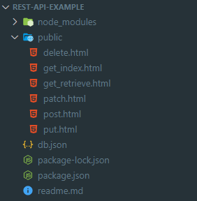
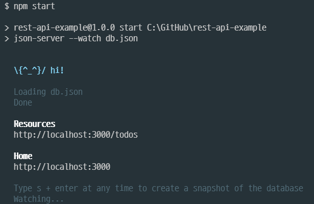
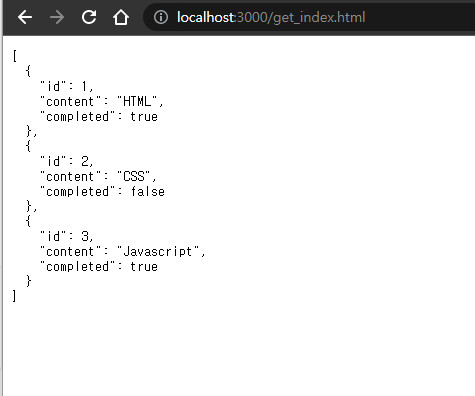
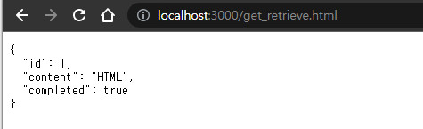
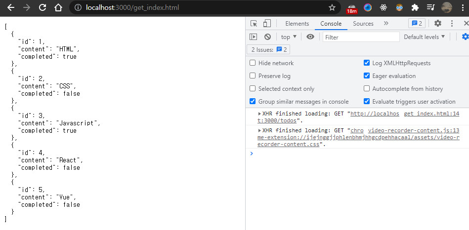

# 44장 REST API

- REST : HTTP를 기반으로 클라이언트가 서버의 리소스에 접근하는 방식을 규정한 아키텍처

- REST API : REST를 기반으로 서비스 API를 구현한 것

- RESTful : REST의 기본 원칙을 성실히 지킨 서비스 디자인


## 44.1 REST API의 구성

| 구성요소              | 내용                           | 표현방법         |
| --------------------- | ------------------------------ | ---------------- |
| 자원(resource)        | 자원                           | URI(엔드포인트)  |
| 행위(verb)            | 자원에 대한 행위               | HTTP 요청 메소드 |
| 표현(representations) | 자원에 대한 행위의 구체적 내용 | 페이로드         |


## 44.2 REST API 설계원칙

1. URI는 리소스를 표현해야한다.

2. 리소스에 대한 행위는 HTTP 요청 메서드로 표현한다.

   | HTTP 요청 메소드 | 종류           | 목적                  | 페이로드 |
   | ---------------- | -------------- | --------------------- | -------- |
   | GET              | index/retrieve | 모든/특정 리소스 취득 | X        |
   | POST             | create         | 리소스 생성           | O        |
   | PUT              | reaplace       | 리소스의 전체 교체    | O        |
   | PATCH            | modify         | 리소스의 일부 수정    | O        |
   | DELETE           | delete         | 모든/특정 리소스 삭제 | X        |

   ```
   # bad : URI에 delete를 명시함
   GET /todos/delete/1
   
   # good
   DELETE /todos/1
   ```

## 44.3 JSON Server를 이용한 REST API 실습

- JSON Server : json 파일을 이용하여 가상 REST API 서버를 구축할 수 있는 툴

#### 최종 디렉터리 구조



#### 과정

- 디렉터리 루트에 json server 설치

```
$ npm install json-server --save-dev
```

- 디렉터리 루트에  db.json 파일 생성

```
{
  "todos": [
    {
      "id": 1,
      "content": "HTML",
      "completed": true
    },
    {
      "id": 2,
      "content": "CSS",
      "completed": false
    },
    {
      "id": 3,
      "content": "Javascript",
      "completed": true
    },
  ]
}
```

- package.json에 스크립트 부분에 json server 실행 명령어 추가->npm start로 실행

```
"scripts": {
    "start": "json-server --watch db.json"
  },
```

## 44.3.4 GET 요청

- #### public 폴더에 get_index.html 파일 생성

```html
<!DOCTYPE html>
<html>
  <body>
    <pre></pre>
    <script>
      // XMLHttpRequest 객체 생성
      const xhr = new XMLHttpRequest();

      // HTTP 요청 초기화
      // todos 리소스에서 모든 todo를 취득(index)
      xhr.open("GET", "/todos");

      // HTTP 요청 전송
      xhr.send();

      // load 이벤트는 요청이 성공적으로 완료된 경우 발생한다.
      xhr.onload = () => {
        // status 프로퍼티 값이 200이면 정상적으로 응답된 상태다.
        if (xhr.status === 200) {
          document.querySelector("pre").textContent = xhr.response;
        } else {
          console.error("Error", xhr.status, xhr.statusText);
        }
      };
    </script>
  </body>
</html>

```

npm start 명령어로 JSON Server를 실행한다.



localhost:3000/get_index.html 에 접근하면 db.json에 작성된 모든 todos를 get 요청으로 불러온다.




- #### get_retrieve.html 파일 생성

```html
<!DOCTYPE html>
<html>
  <body>
    <pre></pre>
    <script>
      // XMLHttpRequest 객체 생성
      const xhr = new XMLHttpRequest();

      // HTTP 요청 초기화
      // todos 리소스에서 id를 사용하여 특정 todo를 취득(retrieve)
      xhr.open("GET", "/todos/1");

      // HTTP 요청 전송
      xhr.send();

      // load 이벤트는 요청이 성공적으로 완료된 경우 발생한다.
      xhr.onload = () => {
        // status 프로퍼티 값이 200이면 정상적으로 응답된 상태다.
        if (xhr.status === 200) {
          document.querySelector("pre").textContent = xhr.response;
        } else {
          console.error("Error", xhr.status, xhr.statusText);
        }
      };
    </script>
  </body>
</html>

```

- 핵심코드 : xhr.open("GET", "/todos/1"); 
- todos에서 id가 1번인 특정 todo만 취득한다.
- localhost:3000/get_retrieve.html 에 접근하면 1번 todo만 불러온다.
- 

## 44.3.5 POST 요청

- todos 리소스에 새로운 todo를 생성함

```html
<!DOCTYPE html>
<html>
  <body>
    <pre></pre>
    <script>
      // XMLHttpRequest 객체 생성
      const xhr = new XMLHttpRequest();

      // HTTP 요청 초기화
      // todos 리소스에 새로운 todo를 생성
      xhr.open("POST", "/todos");

      // 요청 몸체에 담아 서버로 전송할 페이로드의 MIME 타입을 지정
      xhr.setRequestHeader("content-type", "application/json");

      // HTTP 요청 전송
      // 새로운 todo를 생성하기 위해 페이로드를 서버에 전송해야 한다.
      xhr.send(JSON.stringify({ id: 4, content: "Angular", completed: false }));

      // load 이벤트는 요청이 성공적으로 완료된 경우 발생한다.
      xhr.onload = () => {
        // status 프로퍼티 값이 200(OK) 또는 201(Created)이면 정상적으로 응답된 상태다.
        if (xhr.status === 200 || xhr.status === 201) {
          document.querySelector("pre").textContent = xhr.response;
        } else {
          console.error("Error", xhr.status, xhr.statusText);
        }
      };
    </script>
  </body>
</html>

```

- 주소창에 localhost:3000/post.html 를 입력하면 id가 5인 Angular 객체가 추가된다.

- localhost:3000/get_index.html 에 다시 접근해보면 db.json에 추가된 것을 알 수 있다.

  

## 44.3.6 PUT 요청

- put은 특정 리소스 전체를 교체할 때 사용한다.

```html
<!DOCTYPE html>
<html>
  <body>
    <pre></pre>
    <script>
      // XMLHttpRequest 객체 생성
      const xhr = new XMLHttpRequest();

      // HTTP 요청 초기화
      // todos 리소스에서 id로 todo를 특정하여 id를 제외한 리소스 전체를 교체
      xhr.open("PUT", "/todos/4");

      // 요청 몸체에 담아 서버로 전송할 페이로드의 MIME 타입을 지정
      xhr.setRequestHeader("content-type", "application/json");

      // HTTP 요청 전송
      // 리소스 전체를 교체하기 위해 페이로드를 서버에 전송해야 한다.
      xhr.send(JSON.stringify({ id: 4, content: "React", completed: true }));

      // load 이벤트는 요청이 성공적으로 완료된 경우 발생한다.
      xhr.onload = () => {
        // status 프로퍼티 값이 200이면 정상적으로 응답된 상태다.
        if (xhr.status === 200) {
          document.querySelector("pre").textContent = xhr.response;
        } else {
          console.error("Error", xhr.status, xhr.statusText);
        }
      };
    </script>
  </body>
</html>

```

## 44.3.7 PATCH 요청

- 특정 리소스의 일부를 수정할 때 사용

```html
<!DOCTYPE html>
<html>
  <body>
    <pre></pre>
    <script>
      // XMLHttpRequest 객체 생성
      const xhr = new XMLHttpRequest();

      // HTTP 요청 초기화
      // todos 리소스의 id로 todo를 특정하여 completed만 수정
      xhr.open("PATCH", "/todos/4");

      // 요청 몸체에 담아 서버로 전송할 페이로드의 MIME 타입을 지정
      xhr.setRequestHeader("content-type", "application/json");

      // HTTP 요청 전송
      // 리소스를 수정하기 위해 페이로드를 서버에 전송해야 한다.
      xhr.send(JSON.stringify({ completed: false }));

      // load 이벤트는 요청이 성공적으로 완료된 경우 발생한다.
      xhr.onload = () => {
        // status 프로퍼티 값이 200이면 정상적으로 응답된 상태다.
        if (xhr.status === 200) {
          document.querySelector("pre").textContent = xhr.response;
        } else {
          console.error("Error", xhr.status, xhr.statusText);
        }
      };
    </script>
  </body>
</html>

```



## 44.3.8 DELETE 요청

- todos리소스에서 id를 사용하여 todo를 삭제한다.

```html
<!DOCTYPE html>
<html>
  <body>
    <pre></pre>
    <script>
      // XMLHttpRequest 객체 생성
      const xhr = new XMLHttpRequest();

      // HTTP 요청 초기화
      // todos 리소스에서 id를 사용하여 todo를 삭제한다.
      xhr.open("DELETE", "/todos/4");

      // HTTP 요청 전송
      xhr.send();

      // load 이벤트는 요청이 성공적으로 완료된 경우 발생한다.
      xhr.onload = () => {
        // status 프로퍼티 값이 200이면 정상적으로 응답된 상태다.
        if (xhr.status === 200) {
          document.querySelector("pre").textContent = xhr.response;
        } else {
          console.error("Error", xhr.status, xhr.statusText);
        }
      };
    </script>
  </body>
</html>

```

